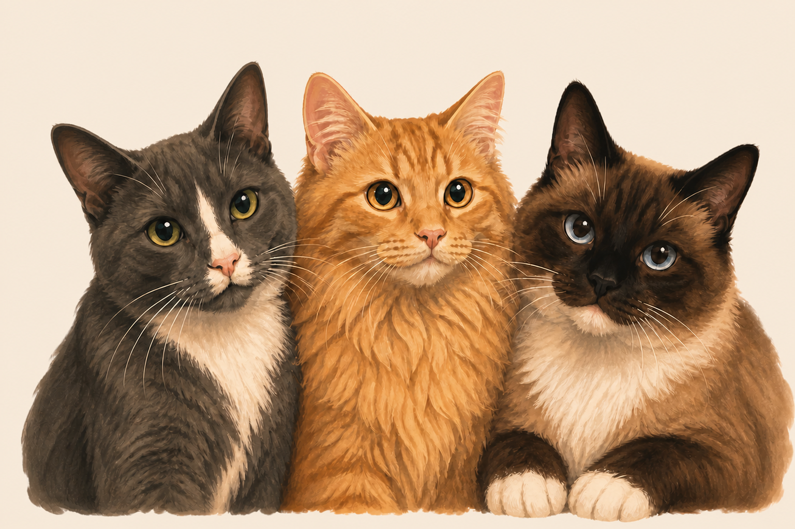

# Apply Counter 🐾

A tiny, always-on-top macOS desktop pet that tracks a daily goal of 10 job applications.

<p align="center">
  
</p>

## Features

- One-tap paw button increments the daily count
- Ten tiny paws show progress at a glance
- Automatically resets after local midnight
- Saves progress locally between launches
- Floats above other windows and follows across Spaces
- Menu-bar controls for add, undo, reset, show, and quit
- No accounts, analytics, or network access

## Requirements

- macOS 14 or newer
- Apple Command Line Tools or Xcode with Swift

## Build and run

```sh
./scripts/build.sh
open "build/Apply Counter.app"
```

The finished app is written to `build/Apply Counter.app` and is ad-hoc signed for local use.

Click the large paw—or press Return—after submitting an application. Drag the pet anywhere on your screen. Hover over it to reveal the ×; use the paw in the menu bar for the remaining controls.

To start it with your Mac, open **System Settings → General → Login Items**, click **+**, and choose `Apply Counter.app`.

## Privacy

The count is stored only in macOS `UserDefaults`. The app makes no network requests. Personal reference photos and discarded artwork drafts are excluded from version control.

## Artwork

The included cat trio was generated from private reference photos and prepared specifically for this project.
